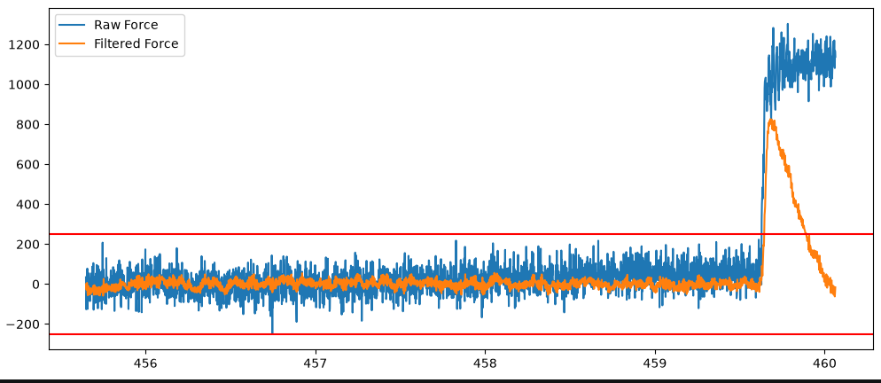

# BDPressure Probe Project

## About This Project


This project is an attempt to port Klipper to the BDpressure probe.
The original work is here. [markniu/bd_pressure](https://github.com/markniu/bd_pressure).
See their wiki, [PandaPi3D wiki](https://pandapi3d.cn/)

***This is not a substitute for the original firmware. This is just a fun personal project driven by curiosity of microcontrollers and AI coding assistants.***

Why is this needed?  This is an experiment. It will probe, but it does not
calibrate pressure advance.


## What Works

- Hardware: the STM32C011, ADS1220, hardware SPI, and direct host UART path have
  been tested.
- Comms:
  - (best option) The BDpressure board's I2C connector can be repurposed for the host UART:
    - 3v3- 5v
    - G
    - C=PB6 which is USART1_TX
    - D=PB7 which is USART1_RX
  - USB to Serial adaptor using repurposed I2C pins.  This may requires decreasing the latency_timer in the driver if Klipper shuts down with communication timeout during Z home.  Mine was 16ms.  Klipper requires 25ms round trip, so the latency alone eats most of that time. Adapt below for your hardware.
    ```
    ls /sys/bus/usb-serial/devices/
    cat /sys/bus/usb-serial/devices/ttyUSB0/latency_timer
    ```

    If that works, make the fix persistent.  Adapt to you hardware again

    ```
    sudo nano /etc/udev/rules.d/99-ftdi-latency.rules
    ACTION=="add", SUBSYSTEM=="usb-serial", DRIVER=="ftdi_sio", ATTR{latency_timer}="2"
    ```
  - Software serial is experimental and should be avoided for normal use. Will probably need the same latency fix as above.
- Software: tap-style probing, homing, bed mesh probing, raw count reporting,
  and buzz filtering. Pressure advance calibration is not implemented.

## Build config

STM32C011 make menuconfig


Important enabled options:

- Micro-controller architecture: `STMicroelectronics STM32`
- Processor model: `STM32C011`
- Bootloader offset: `No bootloader`
- Clock reference: `Internal clock`
- Communication interface: `Serial (on USART1 PB7/PB6)`
- Baud rate: `250000`
- ADS1220 ADC support
- Homing/probing events using analog sensors

Software serial is also a build option and has been tested up to `38400` baud,
but direct UART was more reliable in testing.

The board's CH340 USB path can be used to flash Klipper with
STM32CubeProgrammer over UART. `stm32flash` did not recognize the STM32C0 in
testing, so STM32CubeProgrammer was used instead.

## BDPressureProbe

The main implementation is `BDPressureProbe` in
`klippy/extras/bdpressure_probe.py`.

This is needed because the BDpressure sensor output is very small.  It puts out about 200,000 counts when compressed (nozzle hitting the bed or filament extrusion).  I assume it's the same in the negative direction but not tested.  For reference, the ADS1220 range is -8,388,608 - 8,388,607.

`BDPressureProbe` subclasses Klipper's normal load-cell probe implementation.
The ADS1220 still performs the low-level ADC communication. The BD load-cell
subclass keeps the original raw BD count value for status and converts each
sample into the wider count range Klipper is designed to consume.

The BDpressure probe reports a much smaller useful raw-count span than a
typical load cell used for 3D printer probing. Klipper's load cell code expects a larger ADS1220-style count
range, so `BDPressureProbe` interpolates between two ranges:

- BDpressure native range:
  `reference_tare_counts` to `reference_tare_counts + bd_range`
- Load-cell compatible range:
  `reference_tare_counts` to `reference_tare_counts + 0x7fffff`

That lets the existing load cell math consume the BD probe data without needing
to rewrite the higher-level probing logic.

## Current State

### Hardware

- ~~SPI bit banging on the small STM32C011 board adds latency.~~ SPI pins now mapped for STM32C011 variant so no longer bit-banging
- The STM32C011 is very resource constrained, so the firmware configuration has to stay minimal.
- Software serial can keep the CH340 USB path available for flashing, but in testing the STM32C011 needed a direct host UART connection for reliable Klipper communication. ~~The USB-to-serial adapter caused retransmissions and ultimately exceeded `TRSYNC_TIMEOUT`.~~

### Software

- ~~Multi-MCU synchronization hits communication timeouts during Z homing The current suspicion is that SPI bit banging on the STM32C011/ADS1220 path is adding enough latency to expose this.~~
- ~~Thermal drift is the biggest known issue with probing. Real print conditions can move the raw count baseline enough to affect repeated probing.~~
- ~~More testing is needed around `tare_time`, `trigger_force`, and `drift_filter_cutoff_frequency`.~~
- ~~Filtering needs more tuning. The existing drift filter helps reject slow baseline changes, but the project may need better adaptive baseline handling for this sensor.~~
- ~~Some failures only show up during real print-start conditions, after heat soak, bed mesh, and repeated taps.~~

~~Thermal drift during bed mesh caused trigger before movement and print failure. Top chart is force; bottom chart is raw counts.~~



Homing probe showing before and after filitering.

I used [Filter Workbench](https://github.com/farmercyst/klipper/blob/stm32c0/scripts/filter_workbench.ipynb) and [get_tap.py](https://github.com/farmercyst/klipper/blob/stm32c0/scripts/get_tap.py) to play around with filter options.


## Software Configuration

This is the configuration used during testing. It shows the custom BDpressure probe parameters and the STM32C011 pin assignments that were used.

```ini
[mcu stm32c011]
serial: /dev/ttyS5
baud: 250000
restart_method: command

[temperature_sensor c0_mcu_temp]
sensor_type: temperature_mcu
sensor_mcu: stm32c011
min_temp: 0
max_temp: 100

[bdpressure_probe]
tare_time: 0.1

spi_bus: spi1_PA6_PA2_PA5
cs_pin: stm32c011:PA4
data_ready_pin: stm32c011:PA3

bd_range: 170434 #170434
input_mux: AIN0_AIN1
gain: 128
pga_bypass: False
sample_rate: 660
counts_per_gram: 200
reference_tare_counts: 1210080
trigger_force: 300
force_safety_limit: 5000
drift_filter_cutoff_frequency: 0.5
drift_filter_delay: 2
buzz_filter_cutoff_frequency: 150.0
buzz_filter_delay: 1
# notch_filter_frequencies: 50, 60
# notch_filter_quality: 0.5
z_offset:0.0

speed: 5
samples: 3
sample_retract_dist: 1.5
lift_speed:5
samples_result: average
samples_tolerance: 0.1
samples_tolerance_retries: 3
activate_gcode:
  bd_led_on
deactivate_gcode:
  bd_led_off

[output_pin c0_led]
pin: stm32c011:PA8
value: 0
shutdown_value: 0

[gcode_macro bd_led_on]
gcode:
    SET_PIN PIN=c0_led VALUE=1

[gcode_macro bd_led_off]
gcode:
    SET_PIN PIN=c0_led VALUE=0
```

Custom or important parameters:

- `[bdpressure_probe]` selects the BDpressure probe implementation.
- `bd_range` is the useful raw-count span of the BDpressure probe. The subclass
  scales this range into the larger ADS1220/load-cell count space.
- `reference_tare_counts` is the raw BDpressure count baseline used as the zero point
  for the BDpressure range conversion.
- `counts_per_gram` is still the load-cell force scale used by Klipper after
  the BDpressure data has been converted into compatible counts.
- `tare_time` controls how long the probe averages samples before each probing
  move. This is important because the BDpressure probe can drift during real
  print conditions.
- `trigger_force` is the force threshold used to stop a probing move.
- `trigger_before_movement_retries` re-tares and retries if Klipper reports
  `Probe triggered prior to movement` before the descent starts.
- `force_safety_limit` sets the maximum allowed probing force before Klipper aborts.
- `drift_filter_cutoff_frequency` enables the existing load-cell probe drift
  filter. Higher values reject more slow drift, but can also delay real trigger
  detection if pushed too far.
- The `spi_bus`, `cs_pin`, and `data_ready_pin` values are the tested
  STM32C011 pin assignments for the ADS1220 connection.
