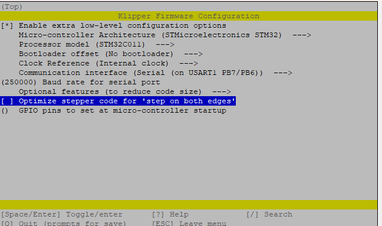
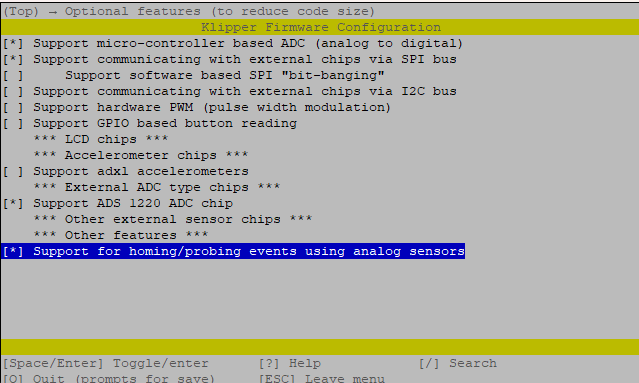
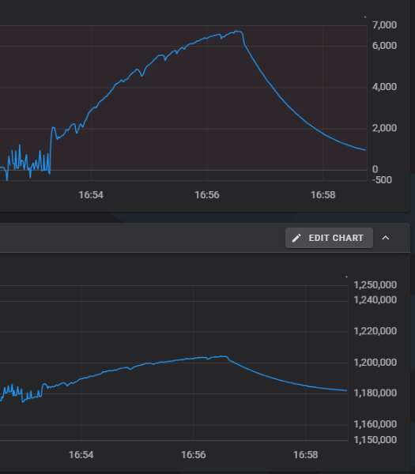
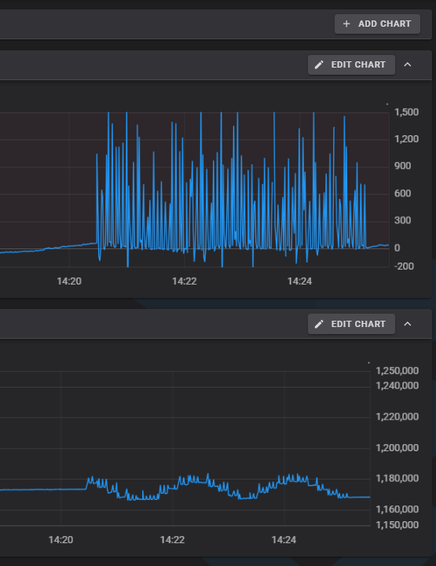
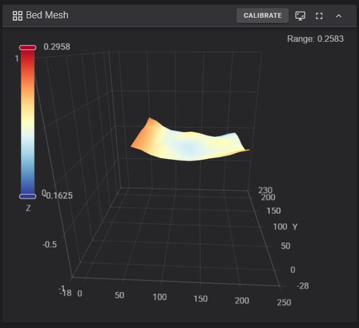

# BDPressure Probe Project

## About This Project


This project is an attempt to port Klipper to the BDpressure probe.
The original work is here. [markniu/bd_pressure](https://github.com/markniu/bd_pressure).
See their wiki, [PandaPi3D wiki](https://pandapi3d.cn/)

***This is not a substitute for the original firmware. This is just a fun personal project driven by curiosity of microcontrollers and AI coding assistants.***

Why is this needed?  This is an experiment. It will not currently add value to your printer.


## What Works

- Klipper can read the BDpressure probe through an ADS1220 ADC.
- The probe can be registered as `sensor_type: bdpressure_ads1220`.
- The BDpressure sensor can feed Klipper's existing `load_cell_probe` path.
- Tare, trigger force, raw range checks, and MCU-side filtering are usable with
  the existing load cell probe commands.
- Status includes BD-specific values such as `bd_range`, `bd_tare_counts`, and
  `last_raw_counts` for debugging and charting.

## Build config

STM32C011 make menuconfig






Important enabled options:

- Micro-controller architecture: `STMicroelectronics STM32`
- Processor model: `STM32C011`
- Bootloader offset: `No bootloader`
- Clock reference: `Internal clock`
- Communication interface: `Serial (on USART1 PB7/PB6)`
- Baud rate: `250000`
- ADS1220 ADC support
- Homing/probing events using analog sensors

Software serial is also an option and has been tested up to `38400` baud.

The board's CH340 USB path can be used to flash Klipper with
STM32CubeProgrammer over UART. `stm32flash` did not recognize the STM32C0 in
testing, so STM32CubeProgrammer was used instead.

## BDPressureADS1220

The main adapter is `BDPressureADS1220` in
`klippy/extras/bdpressure_probe.py`.

This is needed because the BDpressure sensors output is very small.  It puts out about 200,000 counts when compressed (nozzle hitting the bed or filament extrusion).  I assume it's the same in the negative direction but not tested.  For reference, the ADS1220 range is -8,388,608 - 8,388,607.

`BDPressureADS1220` wraps Klipper's normal ADS1220 sensor driver instead of replacing it. The
ADS1220 still performs the low-level ADC communication. The BD adapter catches
the ADS1220 sample batches, keeps the original raw BD count value for status,
and converts each sample into the wider count range expected by Klipper's load
cell code.

The BDpressure probe reports a much smaller useful raw-count span than a
typical load cell. Klipper's load cell code expects a larger ADS1220-style count
range, so `BDPressureADS1220` interpolates between two ranges:

- BDpressure native range:
  `reference_tare_counts` to `reference_tare_counts + bd_range`
- Load-cell compatible range:
  `reference_tare_counts` to `reference_tare_counts + 0x7fffff`

That lets the existing load cell math consume the BD probe data without needing
to rewrite the higher-level probing logic.

## Current Challenges

### Hardware

- SPI bit banging on the small STM32C011 board adds latency.
- The STM32C011 is very resource constrained, so the firmware configuration has
  to stay minimal.
- Software serial is currently needed to keep the CH340 USB path usable, which
  means a separate USB-to-serial adapter is required for the Klipper connection.

### Software

- Multi-MCU synchronization hits communication timeouts during Z homing.
  ~~The current suspicion is that SPI bit banging on the STM32C011/ADS1220 path is
  adding enough latency to expose this.~~
- Thermal drift is the biggest known issue with probing. Real print conditions can move the
  raw count baseline enough to affect repeated probing.
- More testing is needed around `tare_time`, `trigger_force`,
  `drift_filter_cutoff_frequency`, and probe retract timing.
- Filtering needs more tuning. The existing drift filter helps reject slow
  baseline changes, but the project may need better adaptive baseline handling
  for this sensor.
- Some failures only show up during real print-start conditions, after heat
  soak, bed mesh, and repeated taps.

Thermal drift during bed mesh caused trigger before movement and print failure. Top chart is force bottom is raw counts.



Completed bed mesh and more thermal drift





## Software Configuration

This is the configuration used during testing. It is not a recommended final
configuration, but it shows the custom BDpressure probe parameters and the
STM32C011 pin assignments that were used.

```ini
[load_cell_probe]
sensor_type: bdpressure_ads1220
tare_time: 0.3

spi_bus: spi1_PA6_PA2_PA5
cs_pin: stm32c011:PA4
data_ready_pin: stm32c011:PA3


bd_range: 213500
input_mux: AIN0_AIN1
gain: 128
pga_bypass: False
sample_rate: 90
counts_per_gram: 150
reference_tare_counts: 1116500
trigger_force: 175
force_safety_limit: 5000
drift_filter_cutoff_frequency: 0.5

speed: 5
samples: 3
sample_retract_dist: 3
lift_speed: 3
samples_result: average
samples_tolerance: 0.1
samples_tolerance_retries: 3
```

Custom or important parameters:

- `sensor_type: bdpressure_ads1220` selects the BDpressure probe adapter.
- `bd_range` is the useful raw-count span of the BDpressure probe. The adapter
  scales this range into the larger ADS1220/load-cell count space.
- `reference_tare_counts` is the raw BDpressure count baseline used as the zero point
  for the BDpressure range conversion.
- `counts_per_gram` is still the load-cell force scale used by Klipper after
  the BDpressure data has been converted into compatible counts.
- `tare_time` controls how long the probe averages samples before each probing
  move. This is important because the BDpressure probe can drift during real
  print conditions.
- `trigger_force` is the force threshold used to stop a probing move.
- `force_safety_limit` sets the raw-range safety window used while probing.
- `drift_filter_cutoff_frequency` enables the existing load-cell probe drift
  filter. Higher values reject more slow drift, but can also delay real trigger
  detection if pushed too far.
- The `spi_software_*`, `cs_pin`, and `data_ready_pin` values are the tested
  STM32C011 pin assignments for the ADS1220 connection.
